# Awesome Data Explorers Landscape

Welcome to the __Awesome Data Explorers Landscape__ repo! This curated list is designed to be your gateway into the world of software, data, and technology companies across various sectors and regions. Whether you're a data enthusiast, tech professional, or just curious, the best time to __explore__ is now.

## Features

- __Curated Lists:__ Explore a wide array of tools and companies categorized by sector and region.
- __Regular Updates:__ Stay informed with the latest additions and updates to the landscape.
- __Community Driven:__ Contribute your insights and help expand this valuable resource.

## List

| Category | Title / Source | Preview |
| -------- | ---- | ------- |
| __Artificial Intelligence__ (ML, DL, NLP, CV) | | |
| | [The 2024 MAD (ML, AI & Data) Landscape](https://mattturck.com/MAD2024/)   | [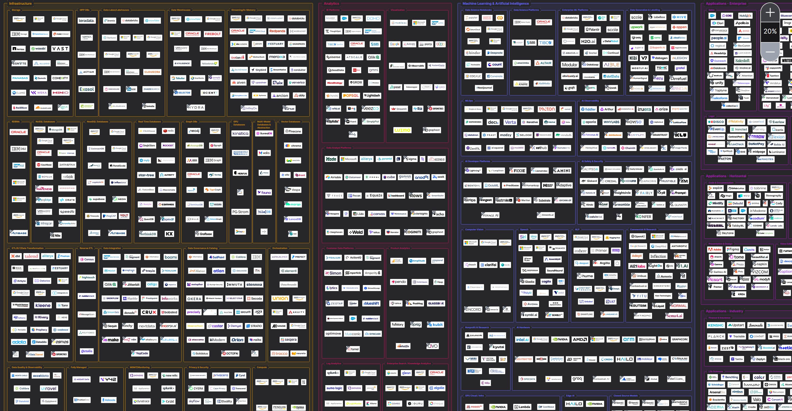](https://mattturck.com/landscape/mad2024.pdf) |
| | [Base10 Trend Map: Generative AI](https://base10.vc/post/generative-ai-mission-critical/)   | [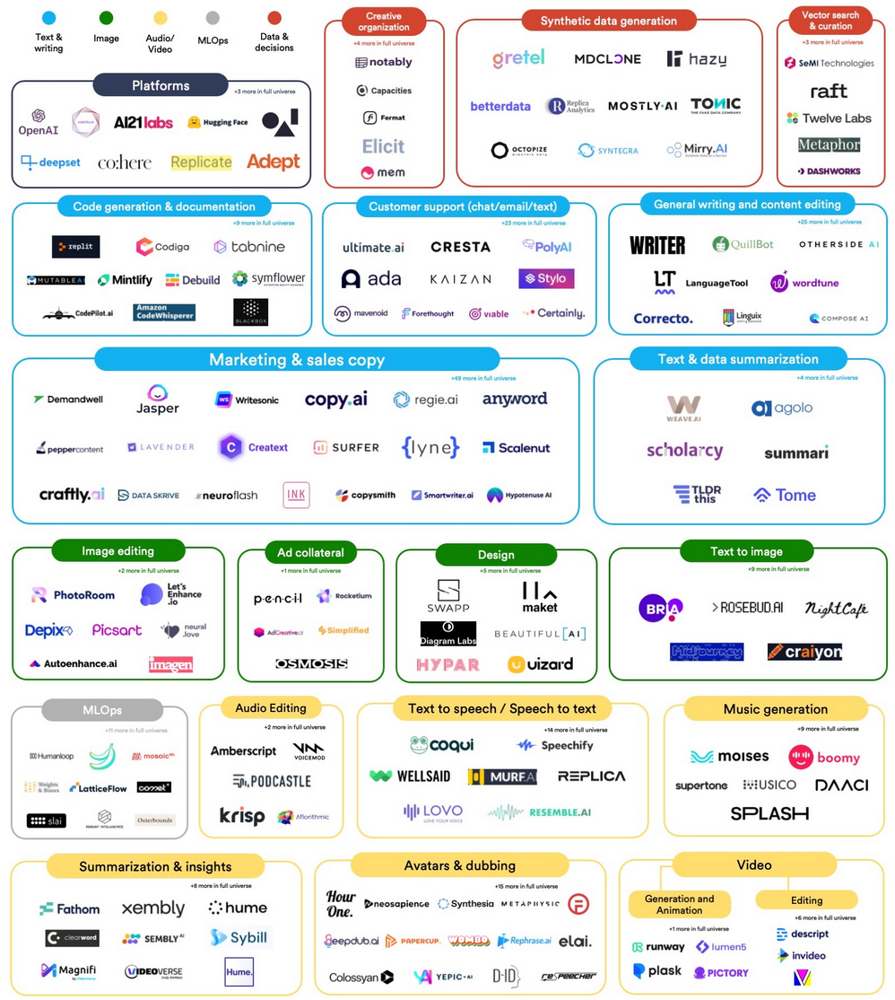](https://images.ctfassets.net/lt8kc6pi0l97/1M35xJJjcNhrC1sVoQXaAy/7a963443f4e83e3b3b99eff40cbbf796/generative_ai_map_v2.jpg) |
| | [Transformer models: an introduction and catalog](https://arxiv.org/abs/2302.07730)   | [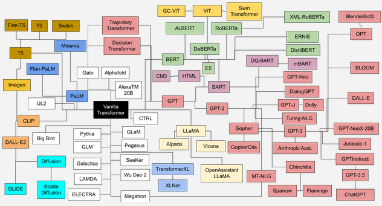](https://amatria.in/blog/transformer-models-an-introduction-and-catalog-2d1e9039f376/) |
| | [The Generative AI Market Map v3](https://www.sequoiacap.com/article/generative-ai-act-two/)   | [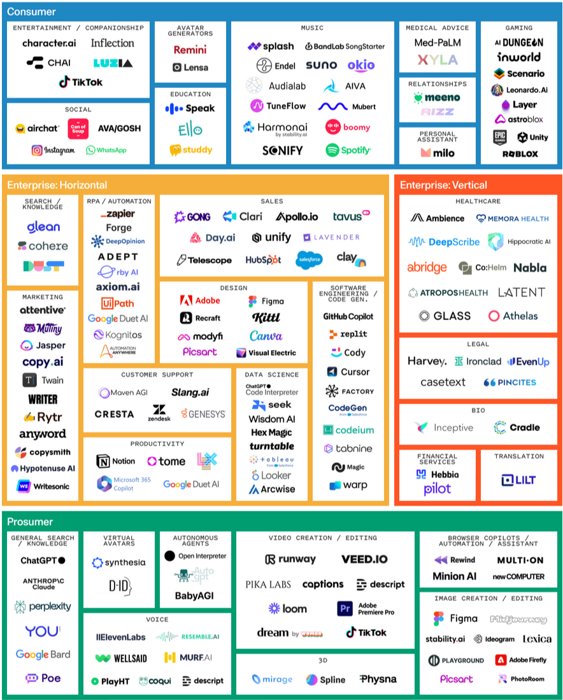](https://www.sequoiacap.com/wp-content/uploads/sites/6/2023/09/generative-ai-market-map-3.png?resize=1440,1920) |
| | [The Generative AI Infrastructure Stack v1](https://www.sequoiacap.com/article/generative-ai-act-two/)   | [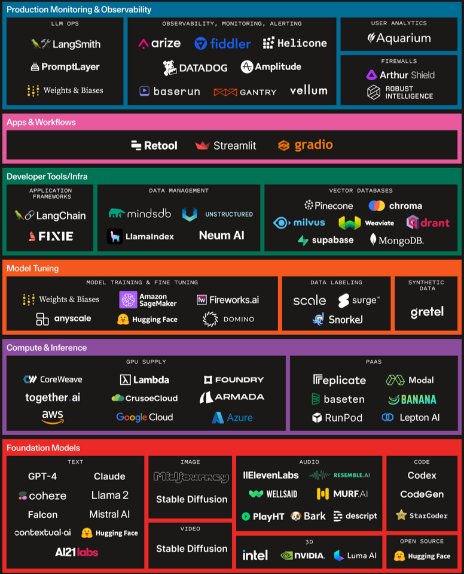](https://www.sequoiacap.com/wp-content/uploads/sites/6/2023/09/generative-ai-model-stack-5.png?resize=1440,1920) |
| | [The Generative AI Startup Landscape](https://www.antler.co/blog/generative-ai)   | [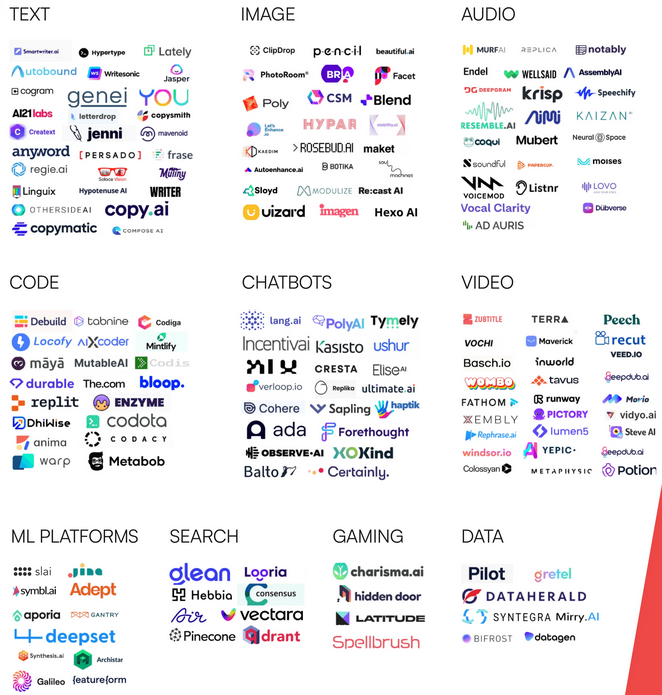](https://cdn.prod.website-files.com/62d6de70dd9e54fe5d03255a/63c8bf26323b0fb50c6c4102_The%20Generative%20AI%20Landscape_v2.webp) |
| __Data Engineering__ (Cloud, DevOps) | | |
| | [Open Source Data Engineering Landscape 2024](https://practicaldataengineering.substack.com/p/open-source-data-engineering-landscape)   | [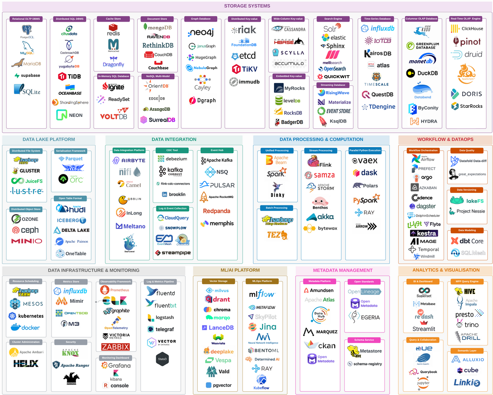](https://github.com/pracdata/awesome-open-source-data-engineering) |
| | [Cloud Native Landscape](https://thenewstack.io/cloud-native/an-introduction-to-the-cloud-native-landscape/)   | [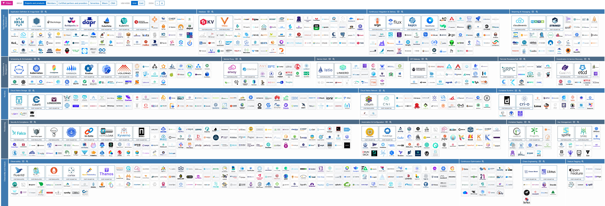](https://landscape.cncf.io/) |
| | [Continuous Delivery Map](https://www.techmonitor.ai/technology/software/devops-made-easy-automic-software-launches-continuous-delivery-map)   | [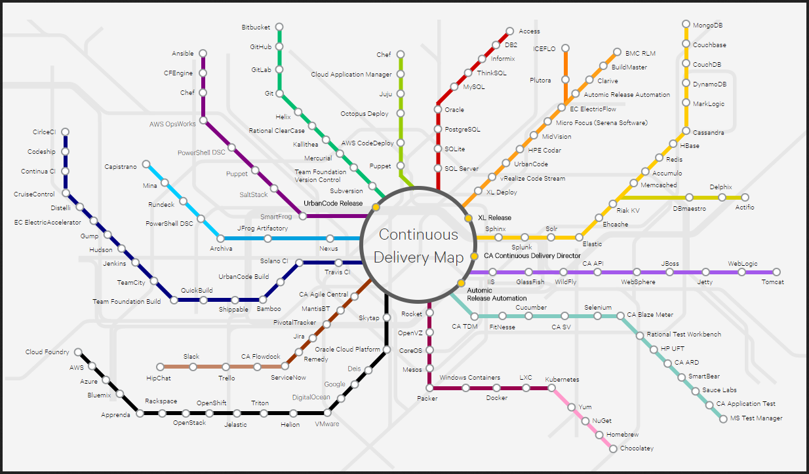](https://graphaware.com/assets/graphtechnologylandscape/GraphTechnologyLandscape2020b.jpg) |
| __Edge Computing__ (IoT) | | |
| | [Internet of Things Landscape 2018](https://mattturck.com/iot2018/)   | [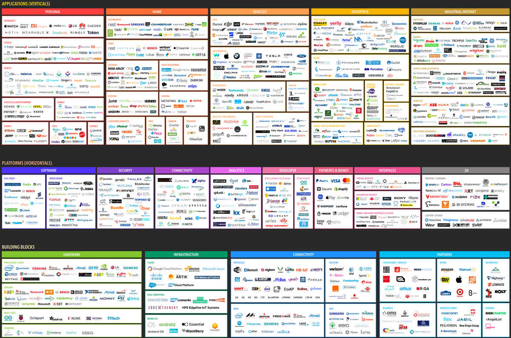](http://mattturck.com/wp-content/uploads/2018/02/2018_Matt_Turck_IoT_Landscape_Final.png) |
| __Graph Technologies__ | | |
| | [Graph Technology Landscape 2020 v2](https://graphaware.com/graphaware/2020/02/17/graph-technology-landscape-2020.html)   | [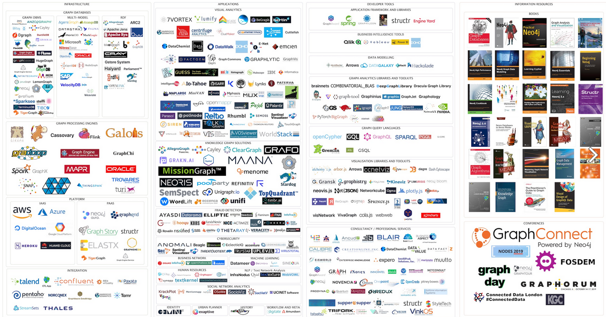](https://graphaware.com/assets/graphtechnologylandscape/GraphTechnologyLandscape2020b.jpg) |
| __Low-code & No-code Solutions__ | | |
| | [G2 Grid® for No-Code Development Platforms](https://www.g2.com/categories/no-code-development-platforms)   | [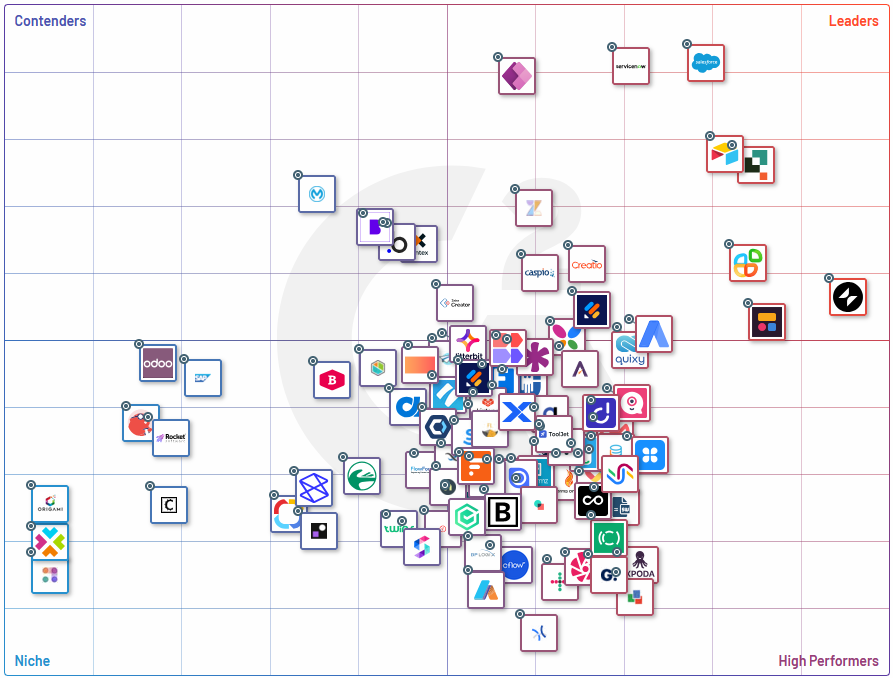](https://www.g2.com/categories/no-code-development-platforms#grid) |

## Thank you

Never stop exploring your interests.
